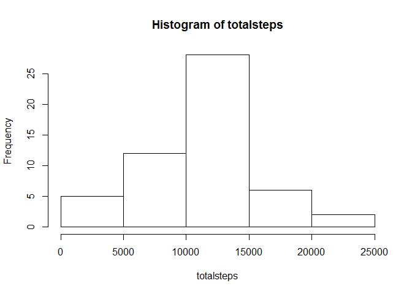
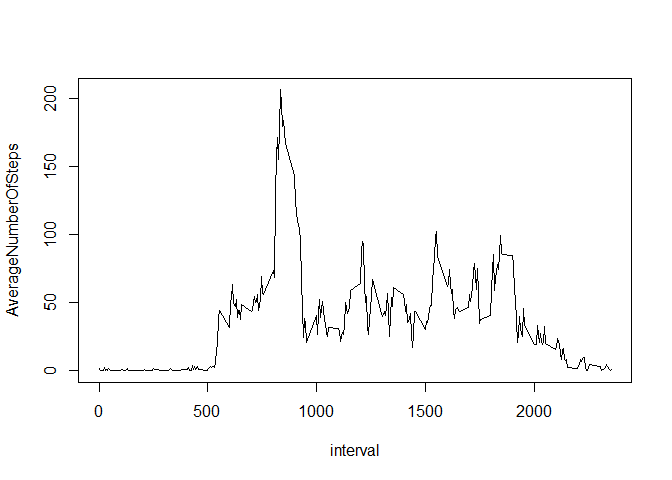
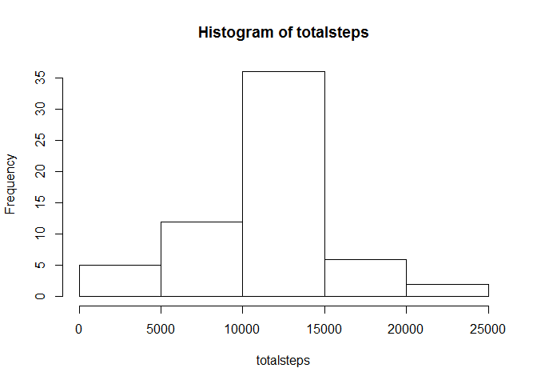

# Reproducible Research: Peer Assessment 1


## Loading and preprocessing the data
First we load the data

```r
download.file("http://d396qusza40orc.cloudfront.net/repdata%2Fdata%2Factivity.zip","repdata_data_activity.zip")
unzip("repdata_data_activity.zip")
activity<-read.csv("activity.csv")
```
Now load the libraries 

```r
library(lubridate)
library(dplyr)
```

```
## 
## Attaching package: 'dplyr'
## 
## The following objects are masked from 'package:lubridate':
## 
##     intersect, setdiff, union
## 
## The following object is masked from 'package:stats':
## 
##     filter
## 
## The following objects are masked from 'package:base':
## 
##     intersect, setdiff, setequal, union
```

```r
library(tidyr)
library(lattice)
```

```
## Warning: package 'lattice' was built under R version 3.1.3
```

## What is mean total number of steps taken per day?
Next we do the first part and calculate and plot the histogram of total steps 

```r
activity<-transform(activity,date=ymd(as.character(date)))
activity1<-group_by(activity,date)
stepsbydate<-summarise(activity1,totalsteps=sum(steps))
with(stepsbydate,hist(totalsteps))
```

 
    
Calculate and report the mean

```r
mean(stepsbydate$totalsteps,na.rm=TRUE)
```

```
## [1] 10766.19
```
Calculate and report the median

```r
median(stepsbydate$totalsteps,na.rm=TRUE)
```

```
## [1] 10765
```


## What is the average daily activity pattern?
Now to plot time series plot of average daily activity pattern

```r
activity2<-group_by(activity,interval)
avgstepbyinterval<-summarise(activity2,AverageNumberOfSteps=mean(steps,na.rm=TRUE))
with(avgstepbyinterval, plot(interval,AverageNumberOfSteps,type="l"))
```

 
Find the 5 minute interval which contains the maximum number of steps

```r
avgstepbyinterval[max(avgstepbyinterval$AverageNumberOfSteps),"interval"]
```

```
## Source: local data frame [1 x 1]
## 
##   interval
## 1     1705
```


## Imputing missing values

Calculate the total number of missing values

```r
sum(is.na(activity))
```

```
## [1] 2304
```
Imputing missing na values with average step by interval

```r
activitynomissing<-activity
for(n in 1:nrow(activitynomissing)){
  if(is.na(activitynomissing[n,"steps"])) {
    activitynomissing[n,"steps"]<-avgstepbyinterval[avgstepbyinterval$interval==activitynomissing[n,3],"AverageNumberOfSteps"]
    }
}
```
Plot the histogram of activitiy with imputed values

```r
activitynomissing1<-group_by(activitynomissing,date)
stepsbydatenomissing<-summarise(activitynomissing1,totalsteps=sum(steps))
with(stepsbydatenomissing,hist(totalsteps))
```

 
Calculate and report the mean

```r
mean(stepsbydatenomissing$totalsteps,na.rm=TRUE)
```

```
## [1] 10766.19
```
Calculate and report the median

```r
median(stepsbydatenomissing$totalsteps,na.rm=TRUE)
```

```
## [1] 10766.19
```
From comparing the mean and median values of new dataset with imputed missing values with old dataset, the mean remains same but the median value changes from 10765 to 10766.19  
The imputing adds more values close to the mean and therefore brings the median value closer to the mean. 
## Are there differences in activity patterns between weekdays and weekends?
Next step is to check differences in activities between weekdays and weekends

```r
activitynomissing<-transform(activitynomissing,dayofweek=as.character(weekdays(date)))
activitynomissing$dayofweek<-as.character(activitynomissing$dayofweek)
activitynomissing[,"weekdayorweekend"]<-"weekday"
activitynomissing[activitynomissing$dayofweek=="Saturday","weekdayorweekend"]<-"weekend"
activitynomissing[activitynomissing$dayofweek=="Sunday","weekdayorweekend"]<-"weekend"
activitynomissing<-group_by(activitynomissing,interval,weekdayorweekend)
activitybyweekdayorend<-summarise(activitynomissing,steps=mean(steps))
activitybyweekdayorend$weekdayorweekend<-as.factor(activitybyweekdayorend$weekdayorweekend)
xyplot(steps~interval|weekdayorweekend,data=activitybyweekdayorend,type="l",layout=c(1,2))
```

 
